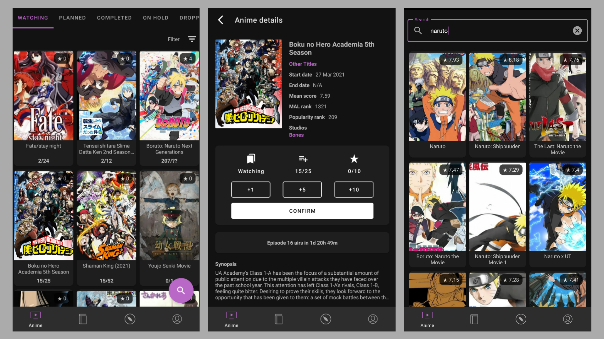

<p align="center">
    <br>
    <b><h1 align="center">MediaHub</h1></b>
</p>
<p align="center">
    <a href="https://github.com/JetBrains/kotlin/releases" alt="Kotlin">
        
    </a>
    <a href="https://github.com/Sharkaboi/MediaHub/blob/master/LICENSE" alt="License">
        
    </a>
    <a href="https://github.com/sharkaboi/mediahub/graphs/contributors" alt="Contributors">
        
    </a>
    <a href="https://github.com/sharkaboi/mediahub/releases" alt="Version">
        
    </a>
    <a href="https://github.com/sharkaboi/mediahub/releases" alt="Downloads">
        
    </a>
    <a href="https://github.com/Sharkaboi/MediaHub/actions" alt="CI">
        
    </a><br>
    A simple, easy to use MyAnimeList client alternative. Uses the <a href="https://myanimelist.net/apiconfig/references/api/v2">MAL Api</a> & <a href="https://anilist.gitbook.io/anilist-apiv2-docs/">Anilist Api</a>. 
</p>

## Screenshots



## Uses

* [Kotlin](https://kotlinlang.org/)
* MVI/MVVM Architecture
* [Retrofit](https://square.github.io/retrofit/)
* [Apollo Android](https://github.com/apollographql/apollo-android)
* [Coroutines](https://kotlinlang.org/docs/coroutines-overview.html)
* [Hilt](https://dagger.dev/hilt/)
* [Datastore](https://developer.android.com/topic/libraries/architecture/datastore)
* [Moshi](https://github.com/square/moshi)
* [haroldadmin/NetworkResponseAdapter](https://github.com/haroldadmin/NetworkResponseAdapter)
* [Paging 3](https://developer.android.com/topic/libraries/architecture/paging/v3-overview)
* [MDC Library](https://material.io/develop/android)
* [Constraint Layout](https://developer.android.com/reference/androidx/constraintlayout/widget/ConstraintLayout)
* [razir/ProgressButton](https://github.com/razir/ProgressButton)
* [Lottie android](https://github.com/airbnb/lottie-android)
* [MPAndroidChart](https://github.com/PhilJay/MPAndroidChart)
* [Jetpack Navigation, SafeArgs](https://developer.android.com/guide/navigation)
* [Settings preference](https://developer.android.com/reference/androidx/preference/package-summary)
* [Coil](https://coil-kt.github.io/coil/)
* [Timber](https://github.com/JakeWharton/timber)
* [ktlint-gradle](https://github.com/jlleitschuh/ktlint-gradle)
* [LeakCanary](https://square.github.io/leakcanary/)
* [Google secrets gradle plugin](https://github.com/google/secrets-gradle-plugin)
* [OSS licenses plugin](https://developers.google.com/android/guides/opensource)

## Releases

* Check out the latest releases [here](https://github.com/Sharkaboi/MediaHub/releases)

## Build instructions

* Install Gradle and Kotlin.
* Clone project.
* Register your app with MyAnimeList as show [here](https://myanimelist.net/blog.php?eid=835707)
* In the project root, add `clientId=<CLIENT ID>` to the `secrets.properties` file. Create if not
  found.
* Open in Android studio or Intellij and build and sync project (Be sure the generated classes of
  Hilt, ViewBinding and Apollo are generated).
* Run on any device and perform OAuth login to give access to your account.

## Credits

* [Photo by Audrey Mari from Pexels](https://www.pexels.com/photo/photo-of-japanese-lanterns-3421920/)
* [Tabler icons by Paweł Kuna](https://tablericons.com/)
* [Bubbles icons by Umar Irshad](https://www.iconfinder.com/iconsets/48-bubbles)

## Contributing

PR's are welcome. Please try to follow the template.

## Privacy, Security and other info

* App only acts as intermediate to MyAnimeList and AniList and does not have it's own server or
  store any data.
* App only has network permissions, the `WRITE_EXTERNAL_STORAGE`,
  `READ_EXTERNAL_STORAGE` & `FOREGROUND_SERVICE` in the merged manifest is
  from [LeakCanary](https://square.github.io/leakcanary/) which is not included in the release
  builds.
* App stores the token
  using [Datastore](https://developer.android.com/topic/libraries/architecture/datastore), which
  is not encrypted. This implies anyone with debugging access or root access
  to your phone can get the your OAuth token if needed. Please keep this in mind.
* The app doesn't fetch "live data" and only shows the snapshot of data of when it was fetched.
  Please refresh to see any changes made through the MyAnimeList website or other clients.
* The app queries all browsers in the device to handle unsupported MyAnimeList deeplinks. This is
  done as the API does not still support all the features provided in the web interface.

## Licence

```
MIT License

Copyright (c) 2021 Sarath S

Permission is hereby granted, free of charge, to any person obtaining a copy
of this software and associated documentation files (the "Software"), to deal
in the Software without restriction, including without limitation the rights
to use, copy, modify, merge, publish, distribute, sublicense, and/or sell
copies of the Software, and to permit persons to whom the Software is
furnished to do so, subject to the following conditions:

The above copyright notice and this permission notice shall be included in all
copies or substantial portions of the Software.

THE SOFTWARE IS PROVIDED "AS IS", WITHOUT WARRANTY OF ANY KIND, EXPRESS OR
IMPLIED, INCLUDING BUT NOT LIMITED TO THE WARRANTIES OF MERCHANTABILITY,
FITNESS FOR A PARTICULAR PURPOSE AND NONINFRINGEMENT. IN NO EVENT SHALL THE
AUTHORS OR COPYRIGHT HOLDERS BE LIABLE FOR ANY CLAIM, DAMAGES OR OTHER
LIABILITY, WHETHER IN AN ACTION OF CONTRACT, TORT OR OTHERWISE, ARISING FROM,
OUT OF OR IN CONNECTION WITH THE SOFTWARE OR THE USE OR OTHER DEALINGS IN THE
SOFTWARE.

```
