<p align="center">
    <br>
    <b><h1 align="center">MediaHub</h1></b>
</p>
<p align="center">
    <a href="https://github.com/JetBrains/kotlin/releases/tag/v1.5.10" alt="Kotlin">
        </a>
    <a href="https://github.com/Sharkaboi/MediaHub/blob/master/LICENSE" alt="License">
        </a>
    <a href="https://github.com/sharkaboi/mediahub/graphs/contributors" alt="Contributors">
        </a><br>
    A simple MAL client. Uses the <a href="https://myanimelist.net/apiconfig/references/api/v2">MAL Api.</a>
</p>

## Uses
* [Kotlin](https://kotlinlang.org/)
* MVI/MVVM Architecture
* [Retrofit](https://square.github.io/retrofit/)
* [Coroutines](https://kotlinlang.org/docs/coroutines-overview.html)
* [Hilt](https://dagger.dev/hilt/)
* [Datastore](https://developer.android.com/topic/libraries/architecture/datastore)
* [Moshi](https://github.com/square/moshi)
* [haroldadmin/NetworkResponseAdapter](https://github.com/haroldadmin/NetworkResponseAdapter)
* [Paging 3](https://developer.android.com/topic/libraries/architecture/paging/v3-overview)
* [MDC Library](https://material.io/develop/android)
* [Constraint Layout](https://developer.android.com/reference/androidx/constraintlayout/widget/ConstraintLayout)
* [razir/ProgressButton](https://github.com/razir/ProgressButton)
* [Lottie android](https://github.com/airbnb/lottie-android)
* [MPAndroidChart](https://github.com/PhilJay/MPAndroidChart)
* [Jetpack Navigation, SafeArgs](https://developer.android.com/guide/navigation)
* [Settings preference](https://developer.android.com/reference/androidx/preference/package-summary)
* [Coil](https://coil-kt.github.io/coil/)
* [LeakCanary](https://square.github.io/leakcanary/)
* [Google secrets gradle plugin](https://github.com/google/secrets-gradle-plugin)
* [OSS licenses plugin](https://developers.google.com/android/guides/opensource)

## Releases
* Check out the latest releases [here](https://github.com/Sharkaboi/MediaHub/releases)

## Screenshots
Anime            |  Manga
:-------------------------:|:-------------------------:
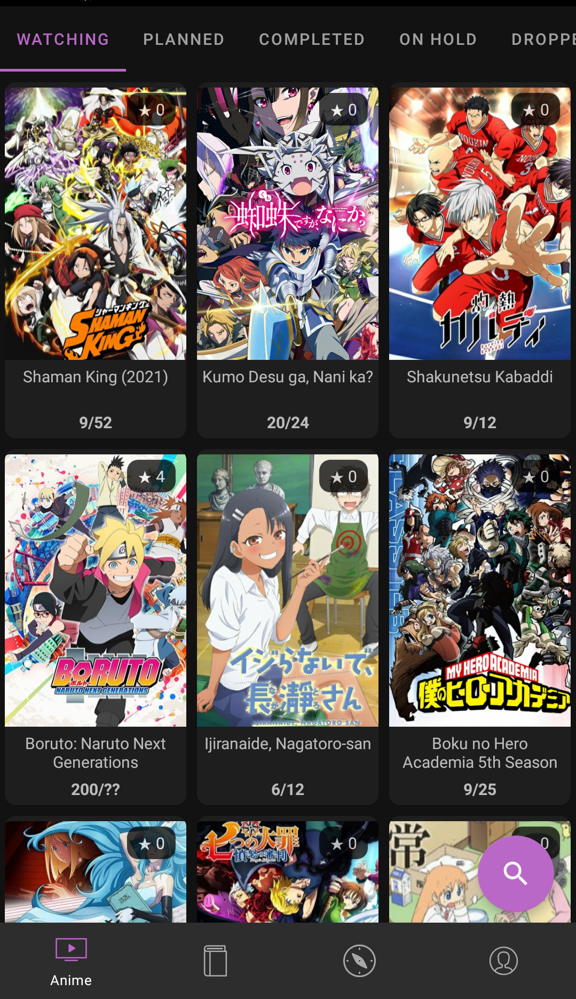  |  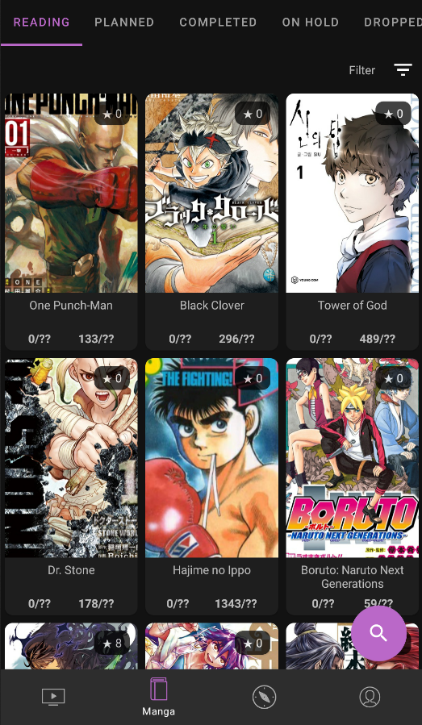
Anime details            |   Manga details
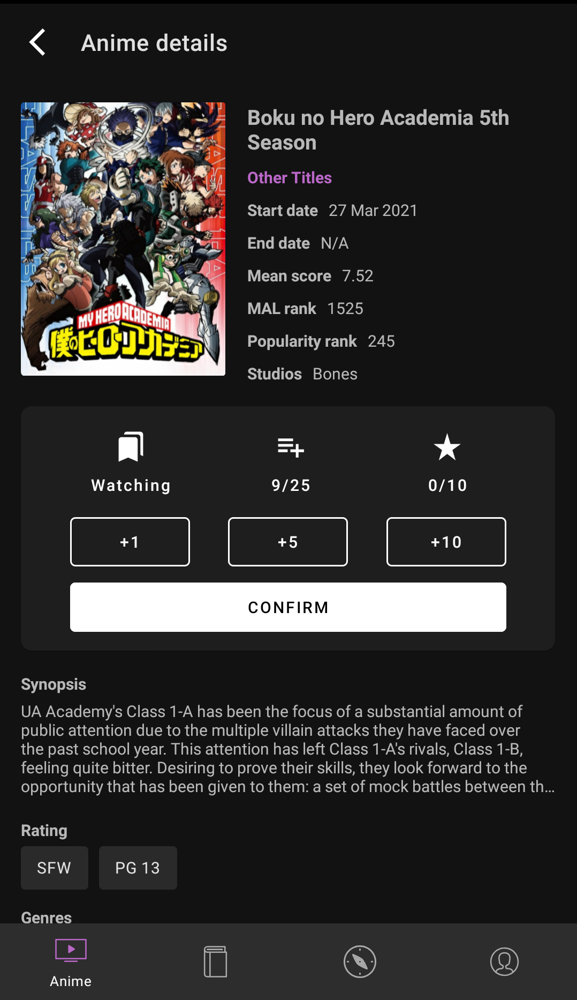  |  
Anime ranking           |  Manga ranking
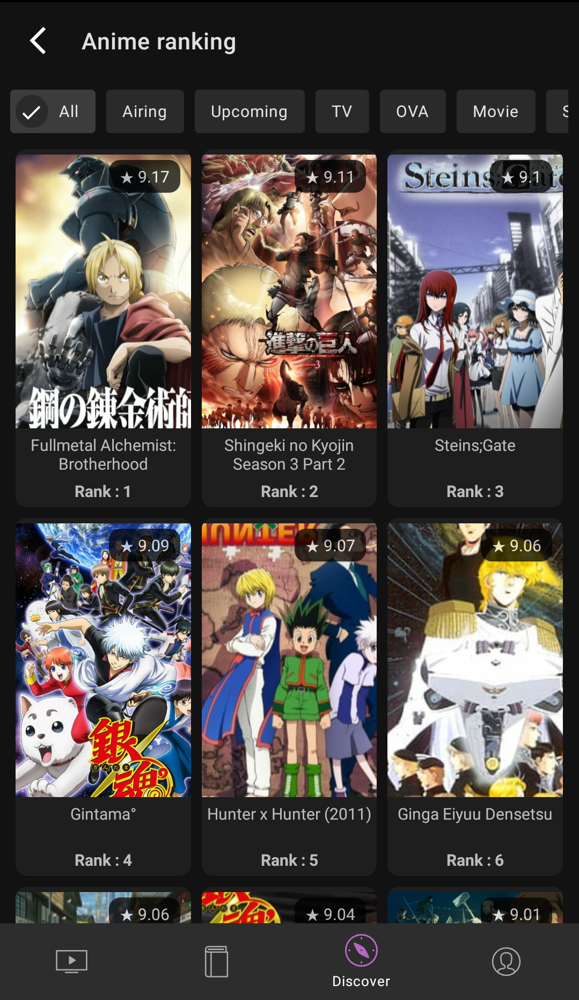  |  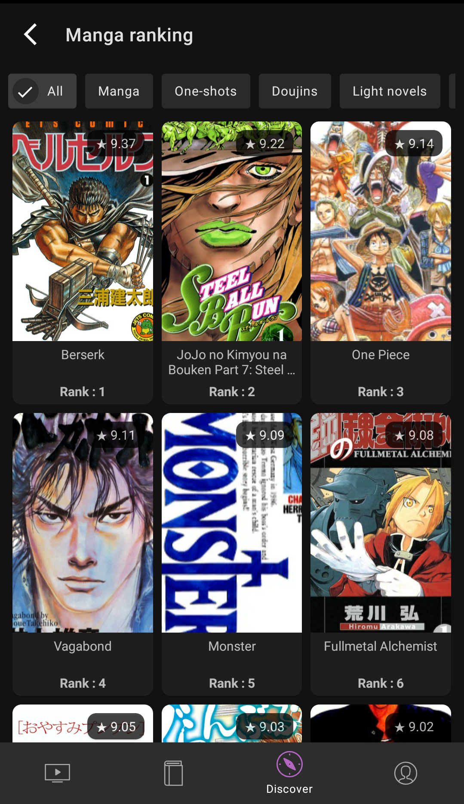
Anime search            |  Manga search
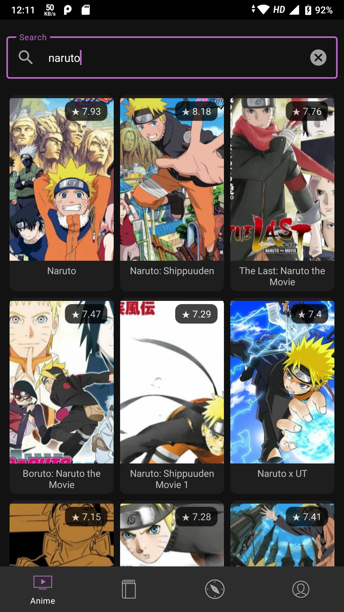  |  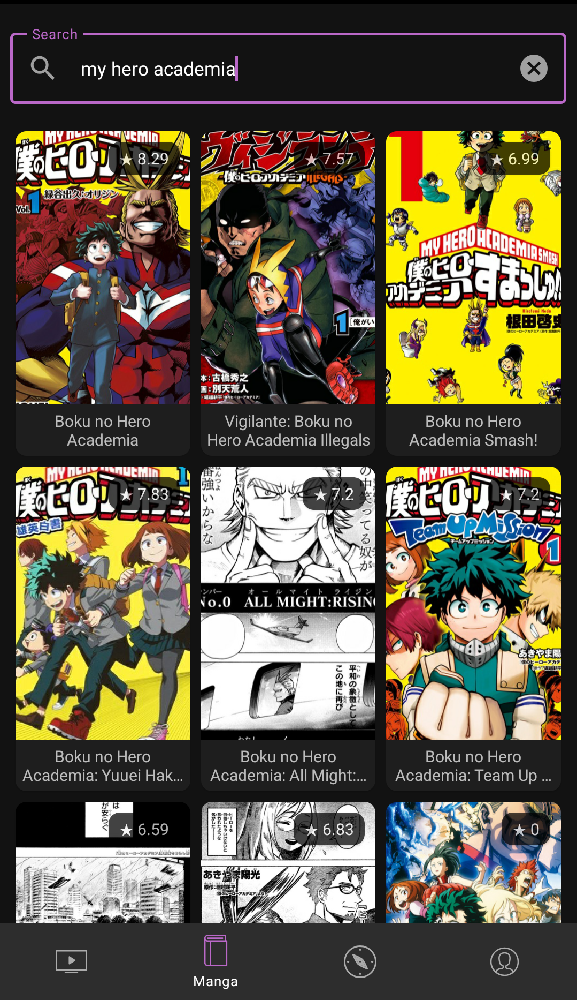
Discover           |  Profile
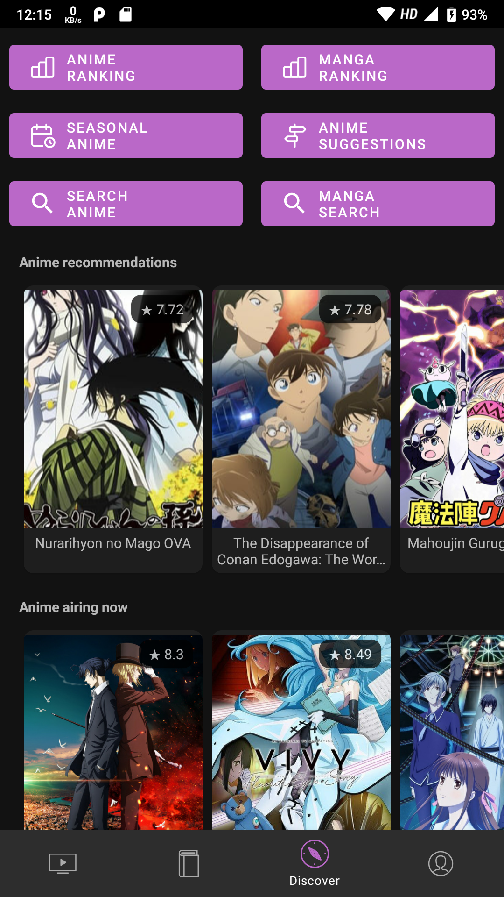  |  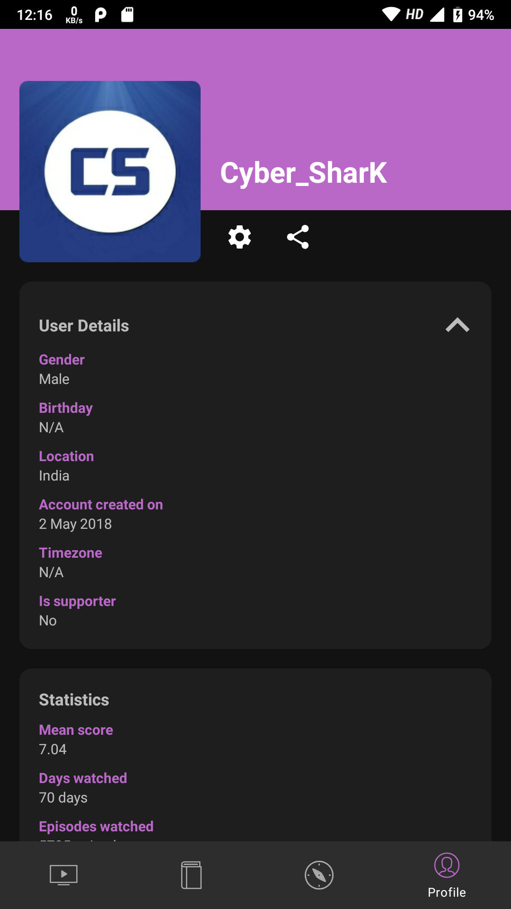
Anime suggestions           |  Anime seasonals
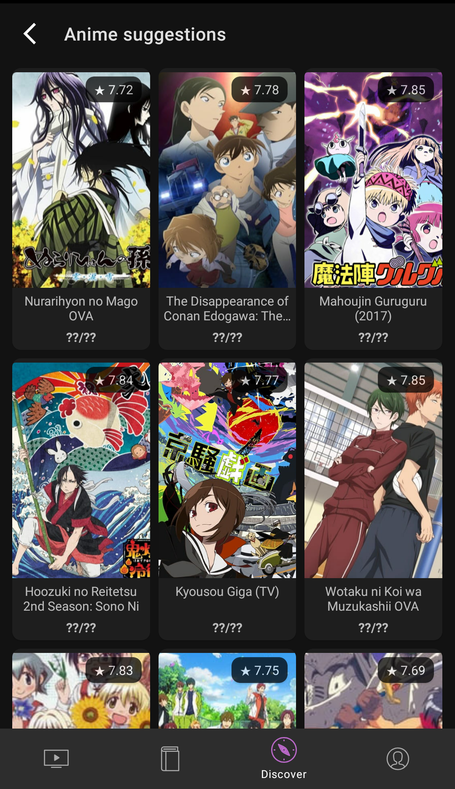  |  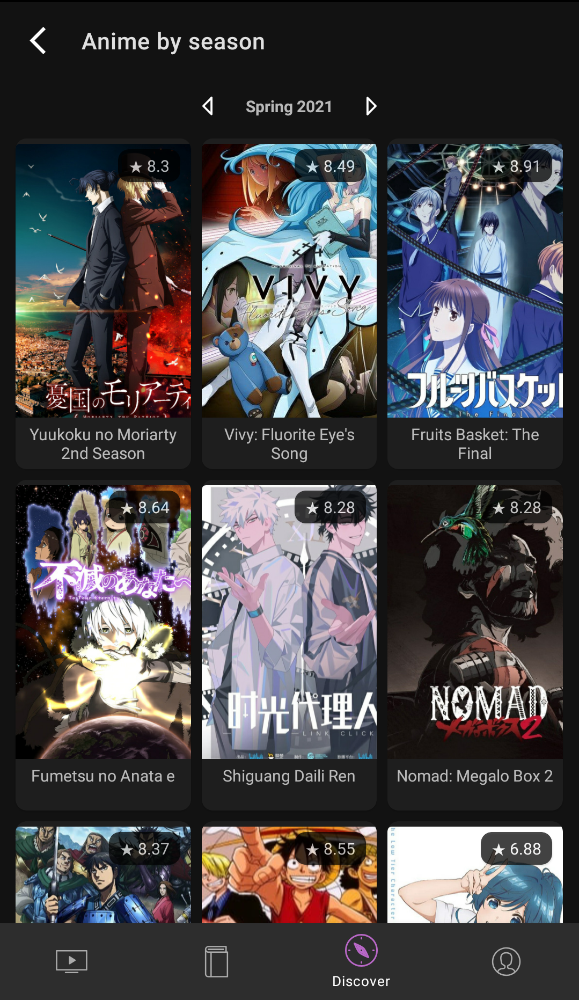
Settings           |  Share
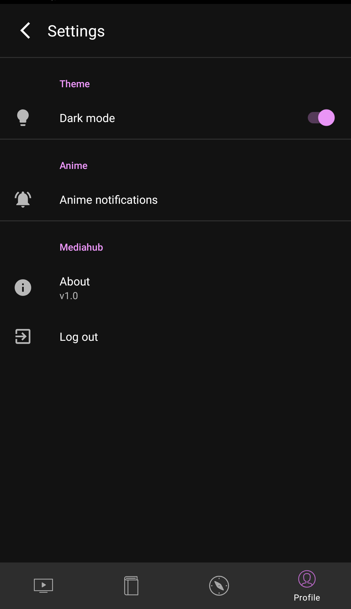  |  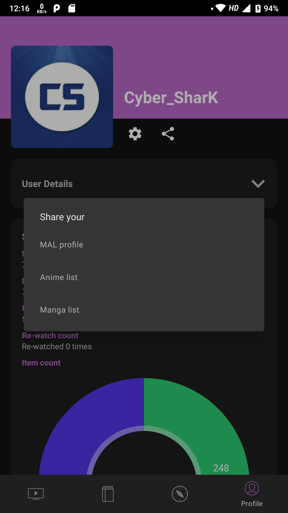

## Build instructions
* Install Gradle and Kotlin.
* Clone project.
* Register your app with MyAnimeList as show [here](https://myanimelist.net/blog.php?eid=835707)
* In the project root, add `clientId=<CLIENT ID>` to the `local.properties` file. Create if not found.
* Open in Android studio or Intellij and build and sync project.
* Run on any device and perform OAuth login to give access to your account.

## Credits
* [Photo by Audrey Mari from Pexels](https://www.pexels.com/photo/photo-of-japanese-lanterns-3421920/)
* [Tabler icons by Paweł Kuna](https://tablericons.com/)
* [Bubbles icons by Umar Irshad](https://www.iconfinder.com/iconsets/48-bubbles)

## Contributing
PR's are welcome. Please try to follow the template.

## Licence
```
MIT License

Copyright (c) 2021 Sarath S

Permission is hereby granted, free of charge, to any person obtaining a copy
of this software and associated documentation files (the "Software"), to deal
in the Software without restriction, including without limitation the rights
to use, copy, modify, merge, publish, distribute, sublicense, and/or sell
copies of the Software, and to permit persons to whom the Software is
furnished to do so, subject to the following conditions:

The above copyright notice and this permission notice shall be included in all
copies or substantial portions of the Software.

THE SOFTWARE IS PROVIDED "AS IS", WITHOUT WARRANTY OF ANY KIND, EXPRESS OR
IMPLIED, INCLUDING BUT NOT LIMITED TO THE WARRANTIES OF MERCHANTABILITY,
FITNESS FOR A PARTICULAR PURPOSE AND NONINFRINGEMENT. IN NO EVENT SHALL THE
AUTHORS OR COPYRIGHT HOLDERS BE LIABLE FOR ANY CLAIM, DAMAGES OR OTHER
LIABILITY, WHETHER IN AN ACTION OF CONTRACT, TORT OR OTHERWISE, ARISING FROM,
OUT OF OR IN CONNECTION WITH THE SOFTWARE OR THE USE OR OTHER DEALINGS IN THE
SOFTWARE.

```
