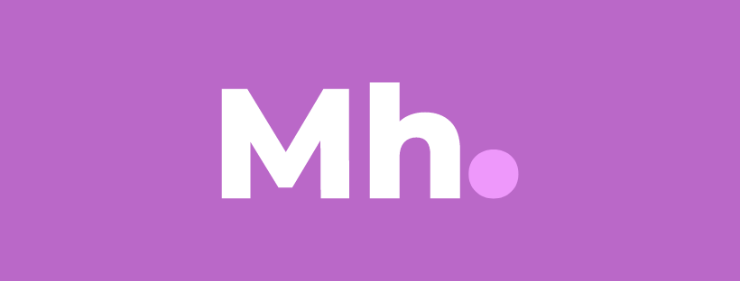

# MediaHub

    
    
    

A simple MAL client.

Uses the [MAL Api](https://myanimelist.net/apiconfig/references/api/v2)

## Uses
* [Kotlin](https://kotlinlang.org/)
* MVI/MVVM Architecture
* [Retrofit](https://square.github.io/retrofit/)
* [Coroutines](https://kotlinlang.org/docs/coroutines-overview.html)
* [Hilt](https://dagger.dev/hilt/)
* [Datastore](https://developer.android.com/topic/libraries/architecture/datastore)
* [Moshi](https://github.com/square/moshi)
* [haroldadmin/NetworkResponseAdapter](https://github.com/haroldadmin/NetworkResponseAdapter)
* [Paging 3](https://developer.android.com/topic/libraries/architecture/paging/v3-overview)
* [MDC Library](https://material.io/develop/android)
* [Constraint Layout](https://developer.android.com/reference/androidx/constraintlayout/widget/ConstraintLayout)
* [razir/ProgressButton](https://github.com/razir/ProgressButton)
* [Lottie android](https://github.com/airbnb/lottie-android)
* [MPAndroidChart](https://github.com/PhilJay/MPAndroidChart)
* [Jetpack Navigation, SafeArgs](https://developer.android.com/guide/navigation)
* [Settings preference](https://developer.android.com/reference/androidx/preference/package-summary)
* [Coil](https://coil-kt.github.io/coil/)
* [LeakCanary](https://square.github.io/leakcanary/)
* [Google secrets gradle plugin](https://github.com/google/secrets-gradle-plugin)
* [OSS licenses plugin](https://developers.google.com/android/guides/opensource)
